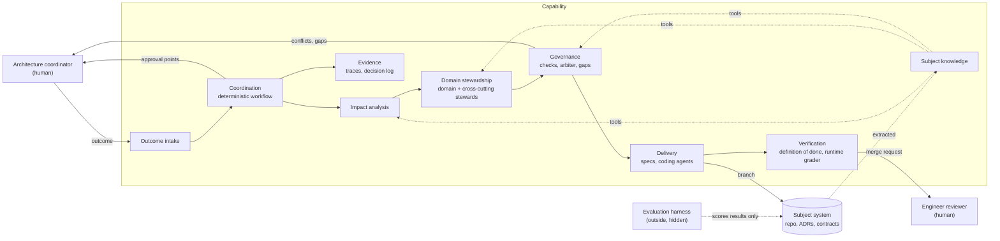

# A1: architecture sketch (first pass)

> **Public version.** Examples are development outcomes or illustrations chosen for this document; none is an evaluation outcome.

Status: sketch for discussion · 5 Oct 2026 · nothing here is decided unless backlog.md says so

This applies strategic domain-driven design to the **capability itself**, not to eShop. The capability is generic over subject knowledge (P3), so nothing below names an eShop domain except as an example.

## Fixed inputs

Already decided in backlog.md, and taken as given here:

- Deterministic orchestrator; LLMs only as workers.
- Retry, then a bounded repair loop, then escalate to the architecture coordinator.
- Typed handoffs: structured fields for what the system acts on, prose for reasoning.
- OpenTelemetry tracing, correlated by outcome ID.
- Domain agents stand in for domain owners; cross-cutting concerns split by concern, not one agent.
- A runtime grader, separate from the evaluation grader.

## The capability's contexts

Nine contexts. Each owns one job and one kind of knowledge. "Agent" below means a role (instructions, knowledge, tools and a model tier) that is instantiated per outcome, not a long-running process.

| Context | Job | Deterministic or LLM | Main outputs |
| --- | --- | --- | --- |
| **Coordination** | Runs each outcome as a durable workflow: stages, budgets, retries, escalations, approval points | Deterministic | Workflow state; escalations |
| **Outcome intake** | Accepts an outcome with its visible examples and value hypothesis; checks completeness; detects ambiguity | Schema check, plus a small model for ambiguity | Accepted outcome, or a clarification request |
| **Subject knowledge** | Holds what is known about the subject: domain catalogue, dependency map, ADR index, contracts, exemplar conventions | Mostly deterministic extraction; embeddings as recall safety net (T8) | Knowledge served to other contexts through tools |
| **Impact analysis** | Finds the domains an outcome touches | Small model to route or screen; deterministic expansion through events and cross-cutting ADRs (T7) | Impact set |
| **Domain stewardship** | One steward per subject context (for eShop: catalogue, basket, ordering, payments, identity, webhooks, storefront), plus cross-cutting stewards split by concern (A3) | Medium or large model, scoped to its own context's knowledge | Domain proposals, each citing the ADRs it relies on |
| **Governance** | Selects applicable ADRs; checks proposals deterministically; detects conflicts and decision gaps; an arbiter resolves conflicts between stewards | Deterministic checks (Q1); large model only for the arbiter | Check results, rulings, proposed ADRs |
| **Delivery** | Turns approved proposals into specs and tasks; coding agents implement them in sandboxes | Spec tooling (T1); coding agents such as Claude Code (T4) | Change set on a branch |
| **Verification** | Runs the definition of done: visible acceptance tests, quality layers, ADR checks; the runtime grader judges what tests can't | Deterministic, plus the runtime grader | Verification report |
| **Evidence** | Assembles the trace, decisions, checks and results into one record per outcome for the reviewer and evaluator | Deterministic | Evidence bundle |

The **evaluation harness** (E1 to E5, hidden tests, the evaluation grader) is deliberately outside the capability. The capability can't read it.

## Context map

## Flow of one outcome

1. **Intake.** Schema-validated outcome: statement, visible examples, value hypothesis (P8). Ambiguity goes back to the coordinator as a clarification request.
2. **Impact analysis.** Router or broadcast screening, then deterministic expansion. Output: an impact set with a reason per domain.
3. **Stewardship.** Each impacted steward proposes changes for its context, citing ADRs. Cross-cutting stewards join when impact analysis or a cross-cutting ADR pulls them in.
4. **Governance.** Deterministic checks on every proposal. Conflicts go to the arbiter; unresolved ones to the coordinator. Decision gaps produce a proposed ADR, which only a human can accept.
5. **Delivery.** Approved proposals become specs and tasks; coding agents implement them, one sandbox per task; failures enter the repair loop.
6. **Verification.** Definition of done runs; the runtime grader checks the judgement residue; failures go back to delivery within the retry budget.
7. **Review and merge.** The engineer reviewer sees the evidence bundle and approves the merge.
8. **Measure.** Instrumentation for the value hypothesis is confirmed as emitted; results go to the coordinator (open loop).

## Human approval points from the use-case ladder

Proposed principle: **human involvement scales with risk.** Two points are always human: accepting an ADR, and merging to main. Everything else depends on the rung.

| Rung | Example | Confirm impact set | Approve plan | Other human decisions | Merge review |
| --- | --- | --- | --- | --- | --- |
| 1. Happy path, one domain | Cancel unpaid orders after 24 hours (DEV-3) | Notify only | No | None | Light |
| 2. Add a field | Order note at checkout (DEV-1) | Notify only | Only if a contract changes; always if the change is breaking | None | Light |
| 3. Complex, several domains | Customers edit their delivery address before dispatch | **Yes** | Only if a cross-cutting steward is involved | None | Deep |
| 4. Sub-domain in an existing context | Product bundles inside catalogue | **Yes** | **Yes**: structure changes | Where the sub-domain's boundary sits | Deep |
| 5. New domain | Loyalty | **Yes** | **Yes** | **Domain charter**: purpose, boundary, ownership, ADR scope; this also creates a new steward | Deep |
| 6a. ADR conflict | Synchronous fraud check with an external provider at checkout | n/a | n/a | Coordinator decides: change the outcome, or supersede the ADR | n/a |
| 6b. Decision gap | Deliver to parcel lockers through a third-party carrier | n/a | n/a | Accept, amend or reject the proposed ADR | n/a |
| 6c. Ambiguous | Make checkout better | n/a | n/a | Answer the clarification | n/a |

Rung 5 is the most interesting: the capability extends itself. Accepting a domain charter adds a context to the subject knowledge and a new steward to the stewardship context. That is worth showing in the video.

**Framing (proposed 5 Oct):** the ladder maps onto the published "in, on and out of the loop" model for architects working with AI. Rungs 1 and 2: the architect is *on* the loop (notified, can intervene). Rungs 3 to 5 and every negative path: *in* the loop (decides). Nothing is fully *out* of the loop, because merges and ADR acceptance are always human. A recognised model makes the approval design easy to explain.

## Typed handoffs (first list)

Each carries structured fields plus a prose rationale field.

| Message | From → to | Key structured fields |
| --- | --- | --- |
| OutcomeRequest | Coordinator → intake | Statement, visible examples, value hypothesis |
| ClarificationRequest | Intake → coordinator | Question, reason, options |
| ImpactSet | Impact analysis → coordination | Domains, reason codes, source (router, expansion, ADR rule), confidence |
| DomainProposal | Steward → governance | Context, changes to contracts and data, ADR IDs relied on |
| CheckResult | Governance → coordination | Check ID, ADR ID, pass or fail, violation detail |
| ConflictReport and Ruling | Governance ↔ arbiter | Conflicting proposals, ADR IDs, decision |
| ProposedADR | Governance → coordinator | Decision, options, scope tags |
| DomainCharter | Steward → coordinator | Purpose, boundary, events, ownership, ADR scope |
| TaskSet | Delivery → coding agents | Tasks, spec links, definition of done |
| VerificationReport | Verification → coordination | Results per layer, grader scores, evidence links |
| Escalation | Coordination → coordinator | Stage, reason, attempts made, options |

## Tracing

One trace per stage, linked by span links and carrying the outcome ID, because an outcome can wait days at an approval point. Spans carry attributes such as outcome ID, context, ADR IDs, rubric version, model, tokens and cost, following OpenTelemetry's generative AI conventions where they exist.

## Questions this sketch raises

1. **Durable workflow engine.** Now backlog T9.
2. **Steward instantiation.** Proposed: stewards are configurations (instructions, knowledge scope, tools, model tier) created per outcome, not running services. Cheaper, and adding a domain means adding a configuration.
3. **Is Evidence its own context,** or a responsibility of Coordination?
4. **Where risk scoring lives:** which context decides the rung, and therefore the approval points?
5. **Sandboxing:** one git worktree or container per coding task; how changes from several domains combine on one branch.
6. **Walk the E5 scenarios through this sketch** to find what breaks. Done: walkthroughs 1 and 2 below.

---

# Walkthrough 1: running use cases through the sketch

Status: 5 Oct 2026 · paper walkthrough of seven use cases. One passes as sketched; six expose gaps. **All seven proposed changes (G1 to G7) accepted on 5 Oct.** G7's improvement policy continues in backlog Q4.

## Results at a glance

| # | Use case | Result | Gap found |
| --- | --- | --- | --- |
| W1 | Add a field: order note at checkout (DEV-1, rung 2) | **Passes** | None |
| W2 | "New arrival" badge on recently added products (rung 1) | Gaps | G1 contracts between stewards; G2 the storefront distorts the risk rung |
| W3 | Loyalty points (rung 5, the worked example from B2) | Gaps | G3 nobody can propose a domain that doesn't exist yet |
| W4 | Synchronous fraud check at checkout (ADR conflict) | Gap | G4 the repair loop can quietly abandon the outcome |
| W5 | Two cross-cutting stewards disagree (E5) | Gap | G5 the arbiter's authority is undefined |
| W6 | ADR superseded while an outcome is in flight (E5) | Gap | G6 no pinned knowledge snapshot |
| W7 | Change to a legacy domain (saving a basket for later) | Gap | G7 checks fail on violations the change didn't cause |

## W1. Order note at checkout · passes

Intake accepts the outcome. Impact analysis finds Ordering and the storefront. The Ordering steward adds a field to the order and to the create-order request; the storefront steward adds it to the checkout form. Governance classifies the contract change as additive (non-breaking), so no plan approval is needed. Delivery, verification and a light merge review follow. Every step maps to a context in the sketch.

## W2. "New arrival" badge on recently added products

The catalogue steward proposes exposing each product's date added through the catalogue API; the storefront steward proposes showing a badge based on it. The storefront's proposal depends on an API change that doesn't exist yet.

- **G1. No step for agreeing contracts between stewards.** When one steward's proposal consumes another's new or changed contract, the contract must be agreed first, then both sides build against it. Proposed: a contract-first step in governance. Producers publish contract proposals; consumers plan against them; deterministic checks confirm both sides match the agreed contract.
- **G2. The storefront makes almost every outcome look multi-domain.** Because the storefront composes everything, this outcome appears to touch two domains and so lands on rung 3, which requires confirming the impact set. Proposed: classify risk by business domains and count the storefront as presentation, unless the outcome changes its own stitching features (such as checkout orchestration).

## W3. Loyalty points

The router classifies outcomes against the domain catalogue, which has no loyalty domain. The sketch says a steward drafts the domain charter, but no loyalty steward exists until the charter is accepted.

- **G3. Nothing can propose a new domain.** Proposed: impact analysis can return "capability not owned by any domain", which routes to a new **domain design** role. That role drafts the charter: purpose, boundary, events consumed and published, ownership and ADR scope, following the exemplar's conventions. Once the coordinator accepts the charter, subject knowledge registers the context and a new steward configuration is created. The workflow then waits at the approval point, which confirms the need for a durable workflow engine.

## W4. Synchronous fraud check at checkout

The Ordering steward proposes a synchronous call to an external fraud provider before payment. Governance flags a breach of the asynchronous integration ADR. The repair loop asks the steward to fix the violation, and it does: it makes the check asynchronous. The checks pass, but the outcome asked for a check before payment is accepted, which no longer happens.

- **G4. The repair loop can satisfy the rules by abandoning the outcome.** Proposed: governance distinguishes an **implementation violation** (repairable without changing what the outcome asks for) from an **intent conflict** (the outcome itself requires breaching the ADR), which escalates straight to the coordinator. After every repair, an intent-preservation check (the runtime grader, against the outcome statement and visible examples) confirms the repaired proposal still delivers the outcome.

## W5. Two cross-cutting stewards disagree

The security steward requires a synchronous token check; the integration steward requires asynchronous messaging. The arbiter resolves it. But if no ADR settles which concern wins, the arbiter is making a new architecture decision.

- **G5. The arbiter's authority is undefined.** Proposed: the arbiter may only **apply** existing decisions, using precedence recorded in the ADRs themselves (for example, scope, or explicit precedence between concerns). If the ADRs don't settle it, that is a decision gap: the arbiter drafts a proposed ADR and the coordinator decides. ADR front matter needs a precedence field (T2).

## W6. ADR superseded while an outcome is in flight

An outcome is in delivery when the coordinator supersedes an ADR it relied on. Its proposals were checked against the old rule; its code may now breach the new one.

- **G6. No pinned knowledge snapshot.** Proposed: at intake, each outcome pins a snapshot (subject commit, ADR set version, schema versions). All stages work against that snapshot. Before merge, verification re-checks against the current snapshot; if anything changed, the outcome returns to governance with the differences listed.

## W7. Change to a legacy domain

Saving a basket for later touches the basket domain, which hasn't been brought to the exemplar's standard. Governance runs the same checks it runs on Ordering, and they fail on problems that existed before the change.

- **G7. Absolute checks punish pre-existing problems.** Proposed: checks on legacy domains are **differential**. Record a baseline of existing violations, and fail only on new ones (a ratchet: the count can fall, never rise). Open policy question: should a change also improve the code it touches, and if so, how much, before it becomes scope creep?

## Accepted additions to the sketch

| Gap | Change | Context affected |
| --- | --- | --- |
| G1 | Contract-first agreement between stewards | Governance |
| G2 | Risk rung counts business domains; storefront counts as presentation unless its stitching changes | Coordination (risk scoring) |
| G3 | "Unowned capability" result, plus a domain design role that drafts charters | Impact analysis, stewardship |
| G4 | Implementation violation versus intent conflict; intent-preservation check after each repair | Governance, verification |
| G5 | Arbiter applies ADR precedence only; anything else is a decision gap | Governance; ADR template (T2) |
| G6 | Knowledge snapshot pinned per outcome; re-check before merge | Subject knowledge, verification |
| G7 | Differential checks with a ratchet on legacy domains | Governance, verification (Q1) |

---

# Walkthrough 2: remaining E5 scenarios

Status: 5 Oct 2026 · four use cases run through the sketch as amended by G1 to G7. None passes cleanly; seven further gaps (G8 to G14). **All proposed changes accepted on 5 Oct.** When splits (G11) can be automatic is decided in backlog A4.

## Results at a glance

| # | Use case | Gaps found |
| --- | --- | --- |
| W8 | Retries run out (DEV-1's acceptance test keeps failing) | G8 failures aren't triaged, and budgets are per task only |
| W9 | A cross-cutting concern inside the change set (customers edit their delivery address) | G9 the impact set can only be set once; G10 pre-existing security defects in touched code; G11 no partial delivery |
| W10 | A domain steward conflicts with a cross-cutting steward | G12 no exceptions mechanism |
| W11 | A new domain adopts platform conventions (loyalty, after its charter is accepted) | G13 new domains are generated freehand; G14 the pinned snapshot can't see a domain created in the same outcome |

## W8. Retries run out

The implementer for DEV-1 fails the visible acceptance test three times; the repair loop is exhausted and the outcome escalates.

- **G8. Failures aren't triaged, and budgets are per task.** The repair loop only retries implementation. But the cause might be a flawed plan (go back to the steward), a defective test (only a human can rule on it, and during a scored run only under the pre-registered withdrawal rule), or a genuine implementation fault (retry). Retrying the wrong stage wastes the budget. Also, several tasks can each stay within their own retry limit while the outcome's total cost runs away. Proposed: classify each failure before retrying and send it back to the stage that caused it; budgets are hierarchical (task within stage within outcome), for both attempts and tokens. An escalation always carries the evidence and the options: raise the budget, revise the plan, amend the outcome or abandon it.

## W9. Customers edit their delivery address

Impact analysis finds Ordering and the storefront. The Ordering steward proposes an endpoint for changing the delivery address of an order that hasn't been dispatched.

- **G9. The impact set can't grow after impact analysis.** Nothing in the outcome's wording mentions security, so the router doesn't pull in the security steward. Security only becomes relevant once a proposal touches an endpoint that acts on a user's own data. Proposed: cross-cutting stewards are also triggered by what proposals touch (new or changed endpoints, events, personal data, authorisation rules), using ADR scope tags. The impact set can grow during stewardship; if growth raises the risk rung, the approval points for the higher rung apply again.
- **G10. Pre-existing security defects in touched code.** Suppose the security steward, reviewing the code the change touches, finds that an existing endpoint accepts input of unlimited length. Q4 says improve touched code, but improvements must be behaviour-preserving, and this fix changes behaviour (some requests that used to succeed are now rejected). Proposed: a security defect found in touched code is never ratcheted silently. It is fixed as its own behavioural change with its own test and flagged to the coordinator, or escalated if fixing it is out of scope.
- **G11. No partial delivery.** Address changes before dispatch can proceed, but changes after dispatch would need a carrier integration nobody has decided on. The sketch can only complete or stop a whole outcome. Proposed: an outcome can split into sub-outcomes. The unblocked part continues; the blocked part waits on its proposed ADR. When a split is automatic, and when the coordinator decides, is settled in backlog A4 (deliver dark).

## W10. A domain steward conflicts with a cross-cutting steward

The loyalty steward wants to keep customer email addresses in the loyalty domain to notify members; the data protection steward cites an ADR on data minimisation. Under G5, the arbiter applies precedence, and cross-cutting ADRs normally bind domains. But sometimes a domain has a legitimate reason to differ.

- **G12. No exceptions mechanism.** Proposed: exceptions (sometimes called waivers) become first-class records: which ADR, which scope, why, who approved and when it expires. Only the coordinator can grant one. Checks read them, so an approved exception passes and an expired one fails. G7's baseline of legacy violations is then simply a set of recorded exceptions, which unifies the two ideas.

## W11. A new domain adopts platform conventions

The loyalty charter is accepted and a loyalty steward is created. It has no code, no ADRs of its own and no history.

- **G13. New domains are generated freehand.** Left to a coding agent, the domain's structure will drift from the exemplar. eShop also needs specific wiring for a new service: registration in the AppHost, use of the shared service defaults, event bus subscriptions, and, if the API is protected, a new API scope and client permissions in Identity's configuration (which today lists scopes for orders, basket and webhooks). Proposed: derive a domain template from the Ordering exemplar and scaffold new domains deterministically from it, then let agents fill in behaviour. The identity and platform wiring is triggered through G9 by the cross-cutting stewards.
- **G14. The pinned snapshot can't see a domain created in the same outcome.** G6 pins knowledge at intake, so later stages can't see loyalty. Proposed: each outcome has a local knowledge overlay holding the changes it has proposed and approved (new domain, contracts, charter). Its own later stages read the snapshot plus the overlay; the overlay merges into shared knowledge only when the outcome merges.

## Accepted additions

| Gap | Change | Context affected |
| --- | --- | --- |
| G8 | Failure triage routes back to the right stage; hierarchical budgets for attempts and tokens | Coordination, verification |
| G9 | Cross-cutting stewards triggered by what proposals touch; impact set can grow, re-applying approvals if the rung rises | Impact analysis, stewardship |
| G10 | Security defects in touched code: fixed as their own behavioural change and flagged, or escalated | Governance, verification |
| G11 | Outcomes can split; unblocked parts continue while gaps wait | Coordination |
| G12 | Exceptions as first-class, approved, expiring records; G7's baseline becomes a set of exceptions | Governance, subject knowledge |
| G13 | Domain template derived from the exemplar; deterministic scaffolding | Delivery |
| G14 | Outcome-local knowledge overlay, merged on outcome merge | Subject knowledge |
